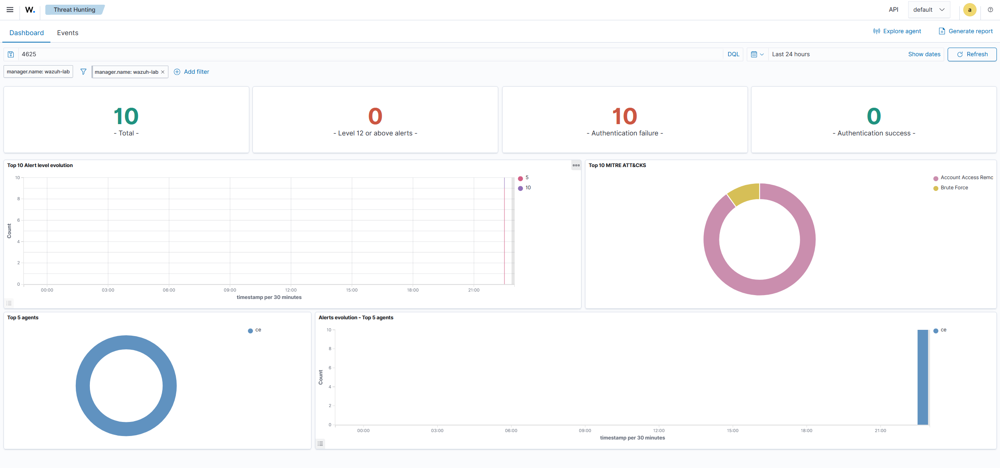

# Wazuh SOC Lab

## Overview

Personal SOC homelab using Wazuh SIEM for Windows event monitoring, threat detection and incident investigation.

The environment includes:
- Wazuh SIEM
- Windows endpoints
- Sysmon telemetry
- Multi-endpoint monitoring
- Threat hunting scenarios

---

## Environment

- Ubuntu Server running Wazuh Manager
- Windows endpoint with Wazuh Agent
- Windows sandbox VM
- Sysmon installed on endpoints

---

## Technologies Used

- Wazuh
- Sysmon
- Windows Event Logs
- SIEM
- Threat Hunting
- VirtualBox

---

## Detection Scenarios

| Scenario | Status |
|---|---|
| Failed Login Detection | ✅ |

---

## MITRE ATT&CK Techniques

| Technique | ID |
|---|---|
| Brute Force | T1110 |

---

## Project Goals

- SIEM practice
- Windows event monitoring
- Threat hunting
- Incident investigation
- MITRE ATT&CK mapping
- Blue Team portfolio
- Endpoint telemetry

---

## Screenshots

