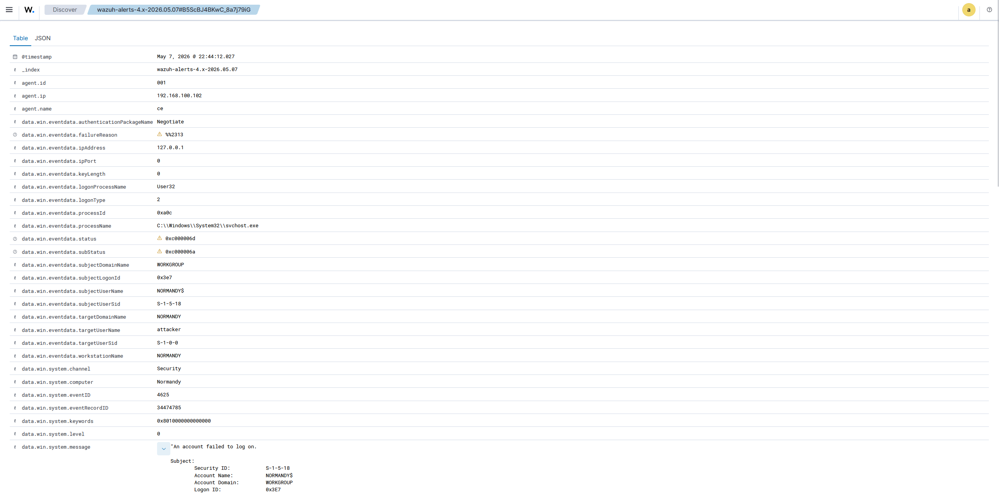
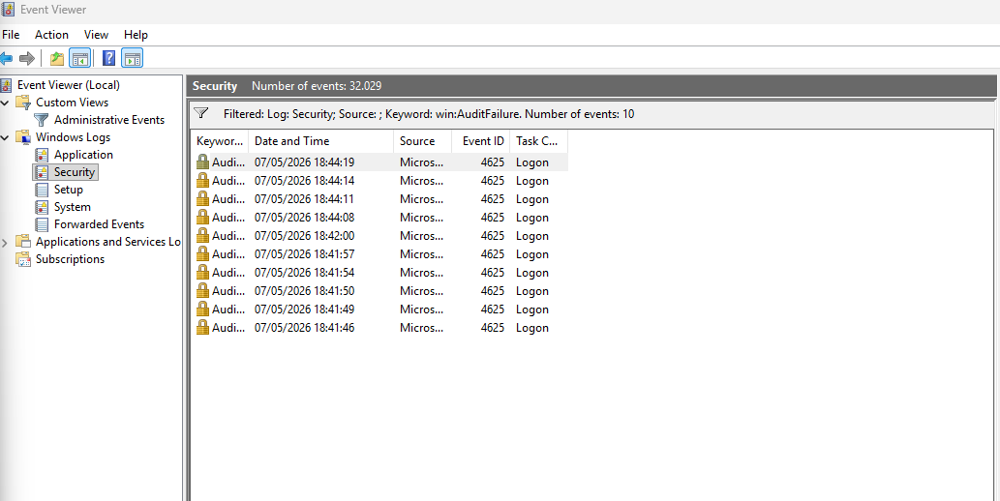

# Failed Login Detection — Wazuh

## Objective

Simulate and investigate failed Windows authentication attempts using Wazuh SIEM.

## Environment

| Component | Description |
|---|---|
| SIEM | Wazuh |
| Manager OS | Ubuntu |
| Endpoint | Windows 11 |
| Agent | Wazuh Agent |

## Attack Simulation

Multiple failed login attempts were manually generated on the Windows endpoint using invalid credentials.

Steps performed:
1. Locked the workstation
2. Attempted invalid logins multiple times
3. Generated Windows Security events

## Detection

Wazuh detected multiple Windows Security Event ID 4625 entries.

### Event ID

4625

### MITRE ATT&CK

T1110 - Brute Force

## Investigation

The events showed repeated authentication failures against a local Windows account.

Observed fields:
- Username
- Timestamp
- Endpoint hostname
- Logon type

The logs were successfully ingested into the Wazuh dashboard and correlated under Threat Hunting.

## Evidence

### Dashboard Alert

### Event Details

### Windows Event Viewer

---

## Lessons Learned

This lab improved  my understanding of:
- Windows authentication monitoring
- SIEM event analysis
- Log investigation workflow
- MITRE ATT&CK mapping
