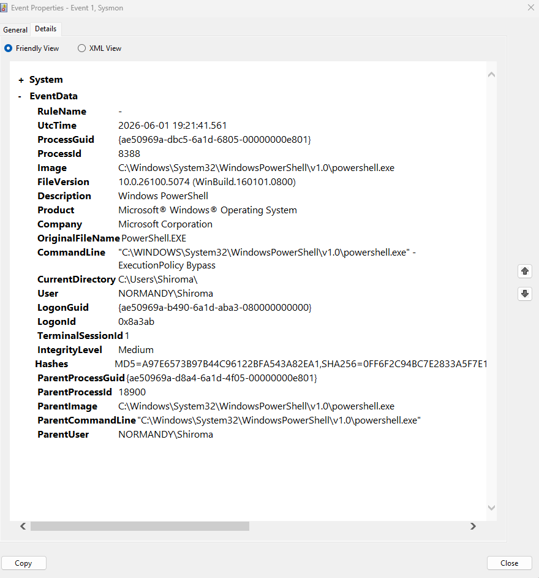

# Suspicious PowerShell Detection — Wazuh

## Objective

Simulate and investigate suspicious PowerShell execution using Sysmon and Wazuh SIEM.

---

## Environment

| Component | Description |
|---|---|
| SIEM | Wazuh |
| Manager OS | Ubuntu |
| Endpoint | Windows 11 |
| Agent | Wazuh Agent |
| Telemetry | Sysmon |

---

## Attack Simulation

A suspicious PowerShell execution was manually generated on the Windows endpoint using the `-ExecutionPolicy Bypass` parameter.

### Steps Performed

1. Opened PowerShell as Administrator
2. Executed:

```powershell
powershell.exe -ExecutionPolicy Bypass
```

3. Generated Sysmon Process Creation events (Event ID 1)
4. Wazuh collected and analyzed the telemetry

---

## Detection

Wazuh detected a PowerShell process spawning another PowerShell instance using a suspicious execution policy.

### Rule Information

| Field | Value |
|---|---|
| Rule ID | 92027 |
| Alert Description | Powershell process spawned powershell instance |
| Event Source | Sysmon |
| Event ID | 1 |

### MITRE ATT&CK

| Tactic | Technique |
|---|---|
| Execution | T1059.001 - PowerShell |

---

## Security Relevance

Attackers frequently abuse PowerShell to execute scripts, download payloads, perform reconnaissance and bypass security controls.

Monitoring PowerShell activity is an important detection capability because it provides visibility into common adversary techniques and suspicious command execution.

---

## Investigation

The investigation revealed that a PowerShell process launched a second PowerShell instance using the `-ExecutionPolicy Bypass` argument.

### Observed Fields

| Field | Value |
|---|---|
| User | NORMANDY\\Shiroma |
| Parent Process | powershell.exe |
| Child Process | powershell.exe |
| Integrity Level | High |
| Event Source | Sysmon |

### Command Line

```text
"C:\WINDOWS\System32\WindowsPowerShell\v1.0\powershell.exe" -ExecutionPolicy Bypass
```

### Analysis

The activity was generated intentionally during a controlled lab exercise.

Although legitimate administrators may use the `-ExecutionPolicy Bypass` parameter, this behavior is commonly associated with attacker activity and therefore warrants investigation in enterprise environments.

---

## Evidence

### Dashboard Alert


### Alert Details


### Sysmon Event



### PowerShell Execution


---

## Lessons Learned

This lab improved my understanding of:

- Sysmon Process Creation monitoring
- PowerShell security monitoring
- Wazuh detection rules
- Windows endpoint telemetry
- MITRE ATT&CK mapping
- SOC investigation workflows
