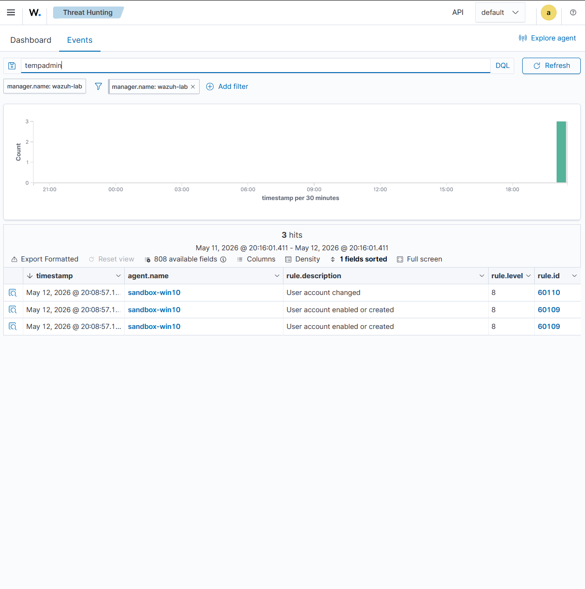
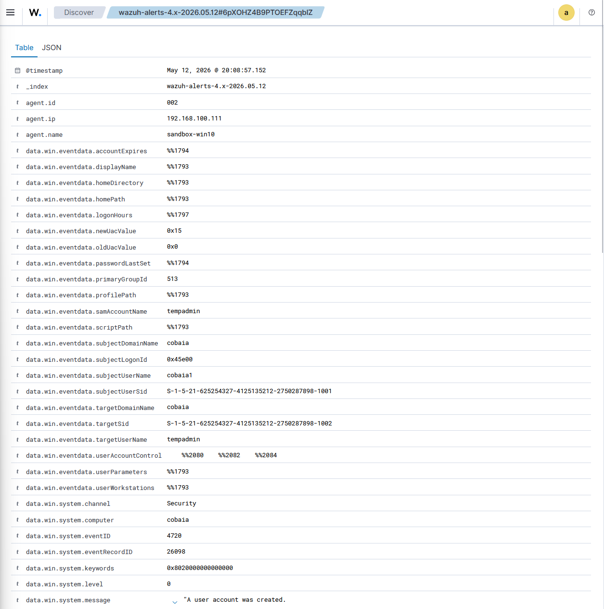
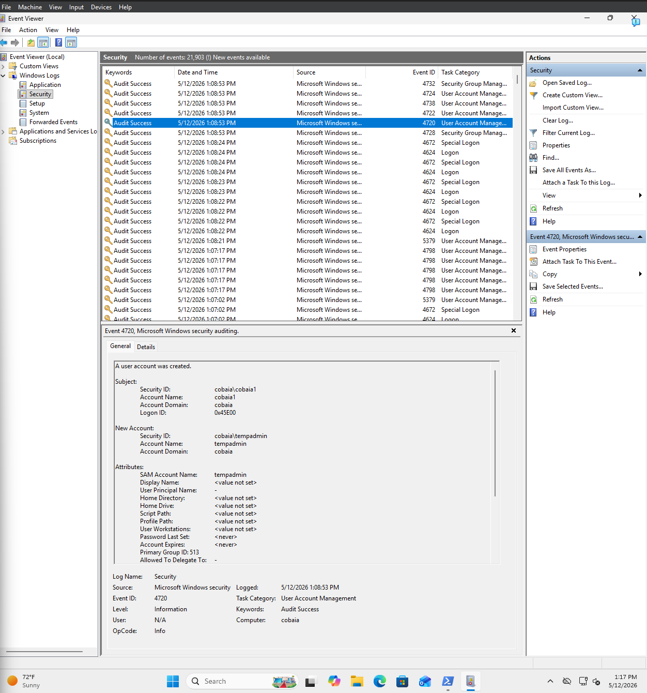

# User Creation Detection

## Objective

Detect local user account creation activity using Wazuh SIEM and Windows Security logs.

---

## Environment

- Ubuntu Wazuh Manager
- Windows sandbox VM
- Wazuh Agent
- Sysmon

---

## Detection Scenario

A new local user account was created on the monitored endpoint.

The activity generated Windows Security Event ID 4720 which was successfully ingested into Wazuh.

---

## Investigation

Observed:
- Username created
- Hostname
- Timestamp
- Account creation event

---

## Evidence

---

## MITRE ATT&CK

T1136 - Create Account

---

## Lessons Learned

- Windows account monitoring
- Security Event ID 4720
- SIEM event investigation
- Endpoint visibility
